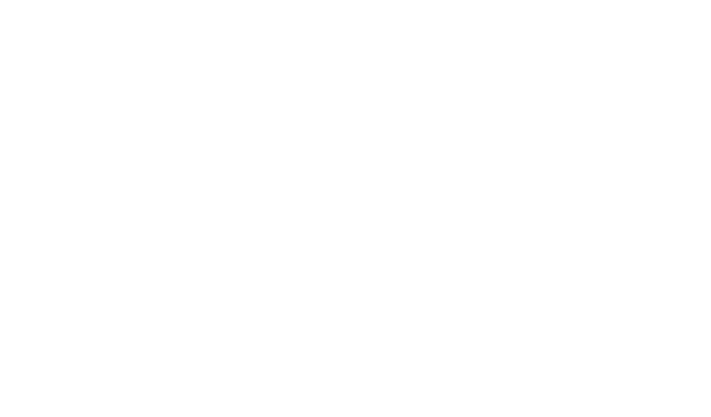

# shapely

A game where you're a shape and so is everyone else.



## Controls

- `WASD` / arrow keys: move
- `1` / `Space`: laserbeam — 5 damage, long and fast, costs mana
- `2`: slash — 8 damage, short-range burst
- `3`: fireball — 7 damage, slower medium-range projectile, costs mana
- `I`: open/close the 24-slot inventory overlay
- `Esc`: close the inventory overlay

The map is a 3×3 room grid (center plus eight surrounding rooms). Every room has a deterministic, different layout: some are sparse, while others use staggered interior maze walls. Room edges have cardinal gaps only when a neighboring room exists; solid outer edges block movement. Walls have Rapier colliders plus top-down movement resolution. Enemy navigation uses a room-local grid generated from those same wall rectangles, with blocked cells expanded for enemy clearance, and A* paths from the `pathfinding` crate. Paths are recalculated when the player enters a new navigation cell. Enemy progress is stored per room, so clearing one room does not clear the others, and cleared rooms stay cleared when revisited. First visits populate a room with a minion (circle), thug (hexagon), and miniboss (octagon); enemies drop health, mana, and speed potions.

## Run native

```powershell
cargo run
```

## Run tests

```powershell
cargo test
```

The test suite uses Rust's built-in test harness, Bevy's headless `App` world
for ECS system behavior, and `rstest` for parameterized attack hitbox cases.
It covers room topology, wall-derived navigation, diagonal corner handling,
attack hit detection, inventory effects, and player/enemy knockback.

## Run in a browser

Install the WASM target and Trunk once:

```powershell
rustup target add wasm32-unknown-unknown
cargo install trunk
trunk serve --release
```

Then open the local URL Trunk prints. `webgl2` is enabled in Bevy for broad browser support. Player and enemy attack effects are implemented as separate WGSL shaders under `assets/shaders/player/` and `assets/shaders/enemy/`, with `assets/shaders/fx_material.wgsl` dispatching the shared material pipeline.
